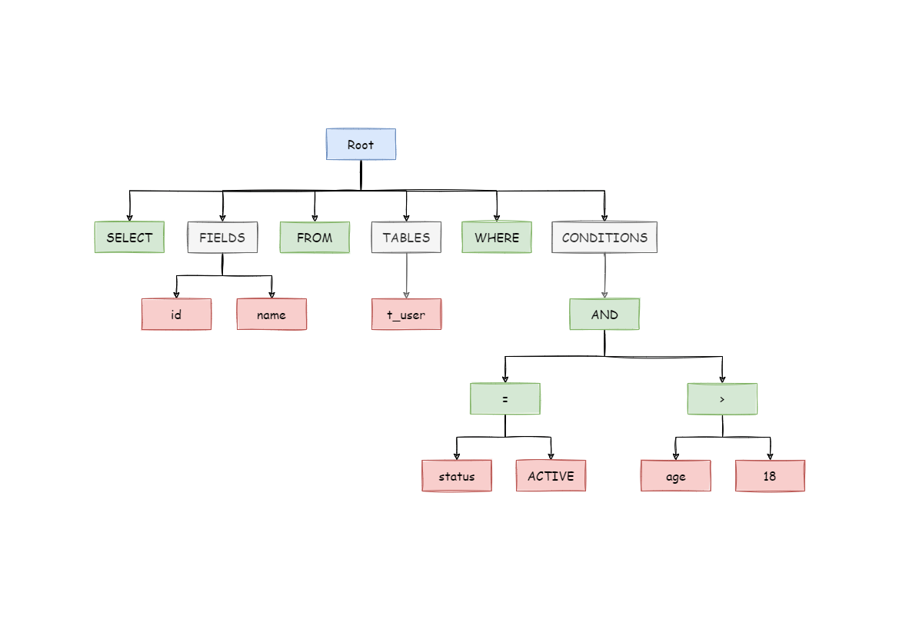
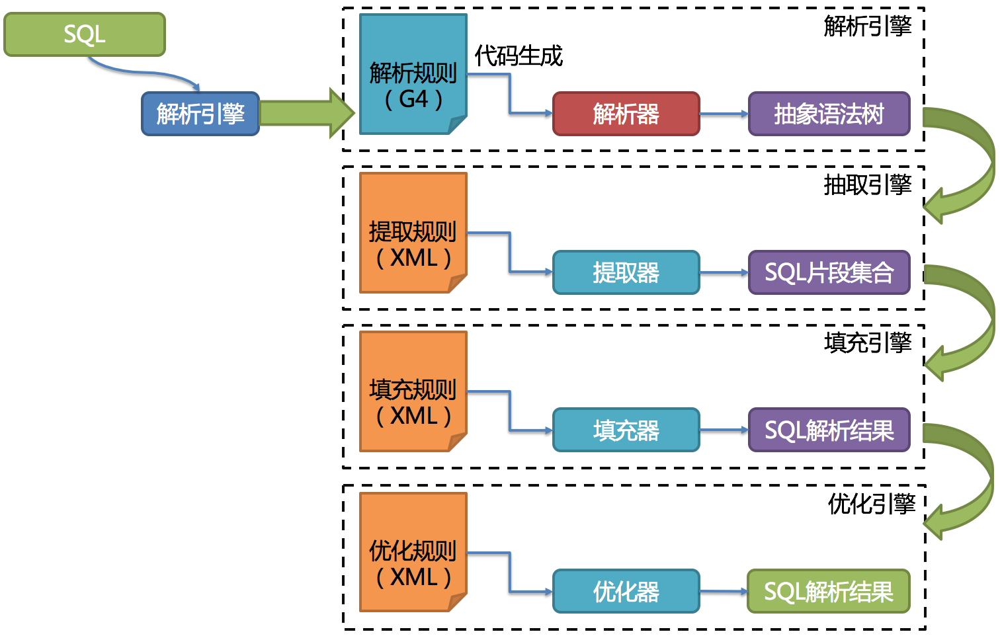

## 1 前言

数据分片流程由`SQL解析 => 执行器优化 => SQL路由 => SQL改写 => SQL执行 => 结果归并`的流程组成。

[](https://shardingsphere.apache.org/document/current/img/sharding/sharding_architecture_cn.png)

### SQL解析

分为词法解析和语法解析。 先通过词法解析器将SQL拆分为一个个不可再分的单词。再使用语法解析器对SQL进行理解，并最终提炼出解析上下文。 解析上下文包括表、选择项、排序项、分组项、聚合函数、分页信息、查询条件以及可能需要修改的占位符的标记。

### 执行器优化

合并和优化分片条件，如OR等。

###  SQL路由

根据解析上下文匹配用户配置的分片策略，并生成路由路径。目前支持分片路由和广播路由。

### SQL改写

将SQL改写为在真实数据库中可以正确执行的语句。SQL改写分为正确性改写和优化改写。

### SQL执行

通过多线程执行器异步执行。

### 结果归并

将多个执行结果集归并以便于通过统一的JDBC接口输出。结果归并包括流式归并、内存归并和使用装饰者模式的追加归并这几种方式。

## 2 解析引擎

相对于其他编程语言，SQL是比较简单的。 不过，它依然是一门完善的编程语言，因此对SQL的语法进行解析，与解析其他编程语言（如：Java语言、C语言、Go语言等）并无本质区别。

### 抽象语法树

解析过程分为词法解析和语法解析。 词法解析器用于将SQL拆解为不可再分的原子符号，称为Token。并根据不同数据库方言所提供的字典，将其归类为关键字，表达式，字面量和操作符。 再使用语法解析器将SQL转换为抽象语法树。

例如，以下SQL：

```sql
SELECT id, name FROM t_user WHERE status = 'ACTIVE' AND age > 18
```

解析之后的为抽象语法树见下图。

[](https://shardingsphere.apache.org/document/current/img/sharding/sql_ast.png)

为了便于理解，抽象语法树中的关键字的Token用绿色表示，变量的Token用红色表示，灰色表示需要进一步拆分。

最后，通过对抽象语法树的遍历去提炼分片所需的上下文，并标记有可能需要改写的位置。 供分片使用的解析上下文包含查询选择项（Select Items）、表信息（Table）、分片条件（Sharding Condition）、自增主键信息（Auto increment Primary Key）、排序信息（Order By）、分组信息（Group By）以及分页信息（Limit、Rownum、Top）。 SQL的一次解析过程是不可逆的，一个个Token的按SQL原本的顺序依次进行解析，性能很高。 考虑到各种数据库SQL方言的异同，在解析模块提供了各类数据库的SQL方言字典。

### SQL解析引擎

SQL解析作为分库分表类产品的核心，其性能和兼容性是最重要的衡量指标。 ShardingSphere的SQL解析器经历了3代产品的更新迭代。

第一代SQL解析器为了追求性能与快速实现，在1.4.x之前的版本使用Druid作为SQL解析器。经实际测试，它的性能远超其它解析器。

第二代SQL解析器从1.5.x版本开始，ShardingSphere采用完全自研的SQL解析引擎。 由于目的不同，ShardingSphere并不需要将SQL转为一颗完全的抽象语法树，也无需通过访问器模式进行二次遍历。它采用对SQL`半理解`的方式，仅提炼数据分片需要关注的上下文，因此SQL解析的性能和兼容性得到了进一步的提高。

第三代SQL解析器则从3.0.x版本开始，ShardingSphere尝试使用ANTLR作为SQL解析的引擎，并计划根据`DDL -> TCL -> DAL –> DCL -> DML –>DQL`这个顺序，依次替换原有的解析引擎，目前仍处于替换迭代中。 使用ANTLR的原因是希望ShardingSphere的解析引擎能够更好的对SQL进行兼容。对于复杂的表达式、递归、子查询等语句，虽然ShardingSphere的分片核心并不关注，但是会影响对于SQL理解的友好度。 经过实例测试，ANTLR解析SQL的性能比自研的SQL解析引擎慢3-10倍左右。为了弥补这一差距，ShardingSphere将使用`PreparedStatement`的SQL解析的语法树放入缓存。 因此建议采用`PreparedStatement`这种SQL预编译的方式提升性能。

第三代SQL解析引擎的整体结构划分如下图所示。

[](https://shardingsphere.apache.org/document/current/img/sharding/parsing_architecture_cn.png)

## 3 路由引擎

根据解析上下文匹配数据库和表的分片策略，并生成路由路径。 对于携带分片键的SQL，根据分片键的不同可以划分为单片路由(分片键的操作符是等号)、多片路由(分片键的操作符是IN)和范围路由(分片键的操作符是BETWEEN)。 不携带分片键的SQL则采用广播路由。

分片策略通常可以采用由数据库内置或由用户方配置。 数据库内置的方案较为简单，内置的分片策略大致可分为尾数取模、哈希、范围、标签、时间等。 由用户方配置的分片策略则更加灵活，可以根据使用方需求定制复合分片策略。 如果配合数据自动迁移来使用，可以做到无需用户关注分片策略，自动由数据库中间层分片和平衡数据即可，进而做到使分布式数据库具有的弹性伸缩的能力。 在ShardingSphere的线路规划中，弹性伸缩将于4.x开启。

### 分片路由

用于根据分片键进行路由的场景，又细分为直接路由、标准路由和笛卡尔积路由这3种类型。

##### 直接路由

满足直接路由的条件相对苛刻，它需要通过Hint（使用HintAPI直接指定路由至库表）方式分片，并且是只分库不分表的前提下，则可以避免SQL解析和之后的结果归并。 因此它的兼容性最好，可以执行包括子查询、自定义函数等复杂情况的任意SQL。直接路由还可以用于分片键不在SQL中的场景。例如，设置用于数据库分片的键为`3`，

```java
hintManager.setDatabaseShardingValue(3);
```

假如路由算法为`value % 2`，当一个逻辑库`t_order`对应2个真实库`t_order_0`和`t_order_1`时，路由后SQL将在`t_order_1`上执行。下方是使用API的代码样例：

```java
String sql = "SELECT * FROM t_order";
try (
        HintManager hintManager = HintManager.getInstance();
        Connection conn = dataSource.getConnection();
        PreparedStatement pstmt = conn.prepareStatement(sql)) {
    hintManager.setDatabaseShardingValue(3);
    try (ResultSet rs = pstmt.executeQuery()) {
        while (rs.next()) {
            //...
        }
    }
}
```

##### 标准路由

标准路由是ShardingSphere最为推荐使用的分片方式，它的适用范围是不包含关联查询或仅包含绑定表之间关联查询的SQL。 当分片运算符是等于号时，路由结果将落入单库（表），当分片运算符是BETWEEN或IN时，则路由结果不一定落入唯一的库（表），因此一条逻辑SQL最终可能被拆分为多条用于执行的真实SQL。 举例说明，如果按照`order_id`的奇数和偶数进行数据分片，一个单表查询的SQL如下：

```sql
SELECT * FROM t_order WHERE order_id IN (1, 2);
```

那么路由的结果应为：

```sql
SELECT * FROM t_order_0 WHERE order_id IN (1, 2);
SELECT * FROM t_order_1 WHERE order_id IN (1, 2);
```

绑定表的关联查询与单表查询复杂度和性能相当。举例说明，如果一个包含绑定表的关联查询的SQL如下：

```sql
SELECT * FROM t_order o JOIN t_order_item i ON o.order_id=i.order_id  WHERE order_id IN (1, 2);
```

那么路由的结果应为：

```sql
SELECT * FROM t_order_0 o JOIN t_order_item_0 i ON o.order_id=i.order_id  WHERE order_id IN (1, 2);
SELECT * FROM t_order_1 o JOIN t_order_item_1 i ON o.order_id=i.order_id  WHERE order_id IN (1, 2);
```

可以看到，SQL拆分的数目与单表是一致的。

##### 笛卡尔路由

笛卡尔路由是最复杂的情况，它无法根据绑定表的关系定位分片规则，因此非绑定表之间的关联查询需要拆解为笛卡尔积组合执行。 如果上个示例中的SQL并未配置绑定表关系，那么路由的结果应为：

```sql
SELECT * FROM t_order_0 o JOIN t_order_item_0 i ON o.order_id=i.order_id  WHERE order_id IN (1, 2);
SELECT * FROM t_order_0 o JOIN t_order_item_1 i ON o.order_id=i.order_id  WHERE order_id IN (1, 2);
SELECT * FROM t_order_1 o JOIN t_order_item_0 i ON o.order_id=i.order_id  WHERE order_id IN (1, 2);
SELECT * FROM t_order_1 o JOIN t_order_item_1 i ON o.order_id=i.order_id  WHERE order_id IN (1, 2);
```

笛卡尔路由查询性能较低，需谨慎使用。

### 广播路由

对于不携带分片键的SQL，则采取广播路由的方式。根据SQL类型又可以划分为全库表路由、全库路由、全实例路由、单播路由和阻断路由这5种类型。

##### 全库表路由

全库表路由用于处理对数据库中与其逻辑表相关的所有真实表的操作，主要包括不带分片键的DQL和DML，以及DDL等。例如：

```sql
SELECT * FROM t_order WHERE good_prority IN (1, 10);
```

则会遍历所有数据库中的所有表，逐一匹配逻辑表和真实表名，能够匹配得上则执行。路由后成为

```sql
SELECT * FROM t_order_0 WHERE good_prority IN (1, 10);
SELECT * FROM t_order_1 WHERE good_prority IN (1, 10);
SELECT * FROM t_order_2 WHERE good_prority IN (1, 10);
SELECT * FROM t_order_3 WHERE good_prority IN (1, 10);
```

### 全库路由

全库路由用于处理对数据库的操作，包括用于库设置的SET类型的数据库管理命令，以及TCL这样的事务控制语句。 在这种情况下，会根据逻辑库的名字遍历所有符合名字匹配的真实库，并在真实库中执行该命令，例如：

```sql
SET autocommit=0;
```

在`t_order`中执行，`t_order`有2个真实库。则实际会在`t_order_0`和`t_order_1`上都执行这个命令。

##### 全实例路由

全实例路由用于DCL操作，授权语句针对的是数据库的实例。无论一个实例中包含多少个Schema，每个数据库的实例只执行一次。例如：

```sql
CREATE USER customer@127.0.0.1 identified BY '123';
```

这个命令将在所有的真实数据库实例中执行，以确保customer用户可以访问每一个实例。

##### 单播路由

单播路由用于获取某一真实表信息的场景，它仅需要从任意库中的任意真实表中获取数据即可。例如：

```sql
DESCRIBE t_order;
```

t_order的两个真实表t_order_0，t_order_1的描述结构相同，所以这个命令在任意真实表上选择执行一次。

##### 阻断路由

阻断路由用于屏蔽SQL对数据库的操作，例如：

```sql
USE order_db;
```

这个命令不会在真实数据库中执行，因为ShardingSphere采用的是逻辑Schema的方式，无需将切换数据库Schema的命令发送至数据库中。

路由引擎的整体结构划分如下图。

[](https://shardingsphere.apache.org/document/current/img/sharding/route_architecture.png)
